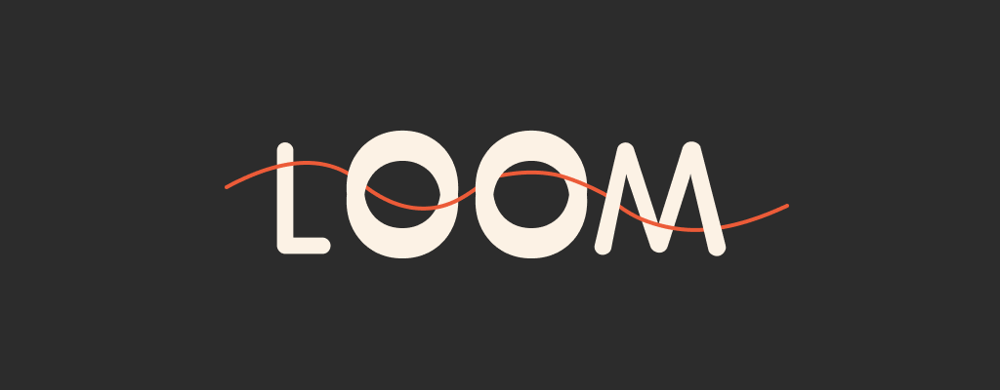

# Loom

    
     
     
    
    
    
     
     
    <i>An Architecture-as-Code compiler to weave behavioral specifications and low-level component contracts into structured, publication-ready documentation.</i>

> [!NOTE]
> **Active Development:** This project is currently a work in progress and is being actively buil!

## Abstract

Loom is an **Architecture as Code** tool designed to unify high-level system behaviors and low-level component contracts into a single specification-to-documentation workflow. 

Traditional specification frameworks like Gherkin excel at defining high-level behavioral scenarios and grouping them into logical features. However, when designing lower-level architectural elements—such as gRPC servers, WebAssembly (WASM) runtimes, registry services, event buses, high-speed broadcast channels, or web servers with specific endpoint sets—no equivalent behavioral specification standard exists. Developers often face a disjointed process when transitioning from user stories to component-level system design. 

Loom solves this by introducing a dual-DSL framework. It combines a modified Gherkin syntax (for behaviors) with a new contract-driven language inspired by Component Contract Specification (CCS) principles. By defining both behavioral and technical components as raw specifications ("threads"), Loom compiles them directly into structured, publication-ready Markdown documentation.

## Objective

**Unify Behavioral and Structural Specs:** Bridge the gap between high-level user stories and low-level component designs under a single, human-readable specification umbrella.

**Formalize Component Contracts:** Provide a structured language for defining low-level component specifications (e.g., event buses, gRPC servers, runtime engines, and system interfaces) with explicit preconditions, postconditions, and invariants.

**Automate Technical Documentation:** Compile machine-parseable specifications into clean, unified Markdown pages, keeping system design documents automatically synchronized with actual specification contracts.

**Maintain Design Integrity:** Provide validation pipelines to verify configuration correctness, file relationships, and spec syntax, preventing documentation drift and architectural layout errors.

## Features

### Functional

- **Dual-DSL Parser:** Support for both Behavioral and Component contracts parsed from a single `.thread` file format based on syntax declarations.
- **Component-Level Specification:** Express contracts for lower-level architectural components including runtimes, services, routing channels, and APIs.
- **Structural Blueprint Compilation:** Uses a central configuration file (`.fabric`) to map sections, specify ordering, and compile target Markdown files.
- **Mermaid Diagram Integration:** Automatically parses diagram declarations in specifications and wraps them into standard GitHub-flavored Mermaid code blocks for instant visual rendering.
- **Semantic Analysis & Validation:** Includes a structural validator to analyze syntax rules, confirm referenced paths, and check diagram structures.
- **VS Code Extension:** Syntax highlighting, context-aware autocompletion for both Behavior and Component specifications and for Manifest File, and custom file icon badges.
- **Model Context Protocol (MCP) Server:** Expose Loom's specs and manifest AST to agentic workflows and LLMs via standard MCP configurations.
- **Loom Skills:** Pre-packaged agent workflows and specification templates to boost specification writing productivity.

### Non-Functional

- **Lightning-Fast Execution:** Built in Rust to perform parsing, extraction, and compilation in milliseconds.
- **Textile Metaphor Coherency:** System entities are cleanly structured around intuitive textile concepts: *Loom* (compilation engine), *Fabric* (document blueprints), *Threads* (specification files), *Weave* (compilation pipeline), and *Comb* (semantic analyzer).
- **Zero Runtime Dependencies for Outputs:** Emits self-contained, standards-compliant Markdown files that render perfectly on web platforms without custom readers.
- **Type-Safe Validation:** Leverages Rust's type system to ensure safe parallel processing and correct AST mapping.

## Specifications

### Requirements

- **Threads:** The specification files (`.thread`) containing raw behavioral scenarios or technical component contracts.
- **Fabric File:** The central manifest configuration (`.fabric`) defining the document output structure and compilation order.
- **Compiler:** The core engine that runs verification, processes the threads, and assembles them into Markdown documentation.

### Dependencies

- **Rust Toolchain:** The compiler and package manager required to build the project.
- **Operating System:** Windows or Linux.

## Getting Started

Installation and Usage Guidelines are inside the docs/begin.md file.
